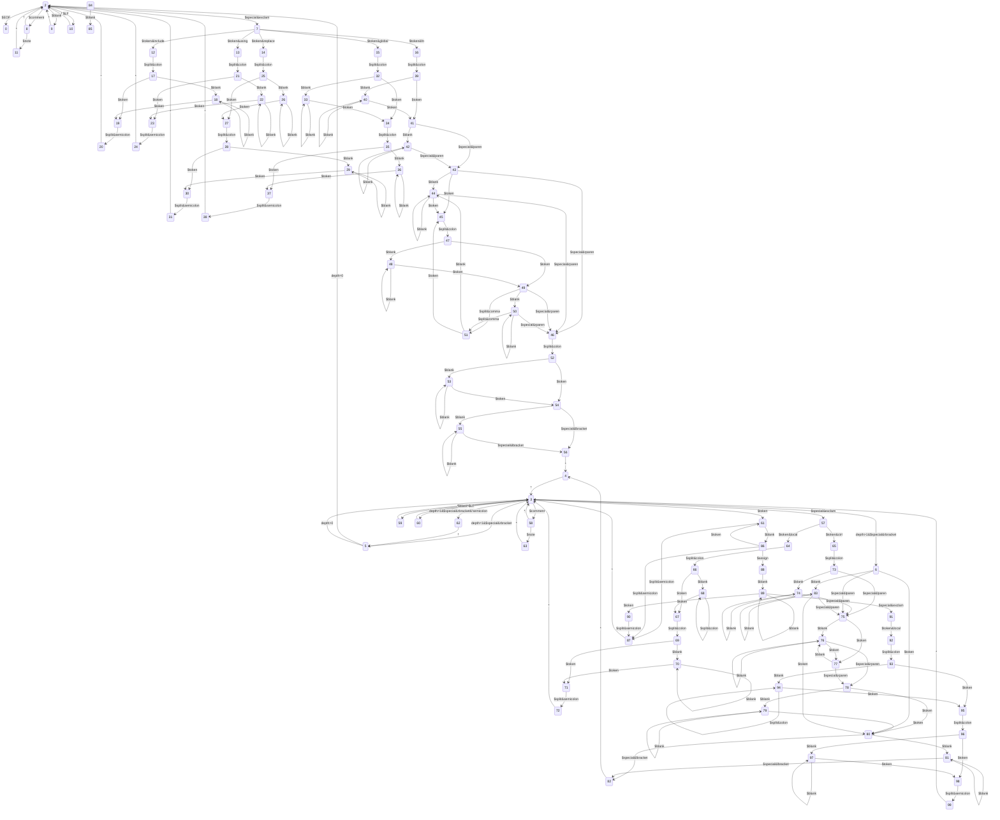
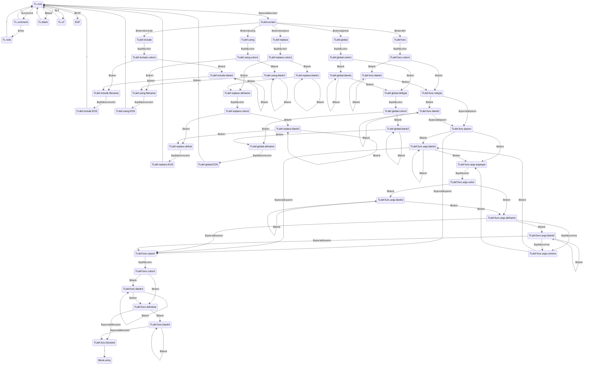

# トークナイザの状態遷移

## 全体図

```mermaid
stateDiagram-v2
2 --> 7: $special&exclam
2 --> 8: $comment
2 --> 9: $blank
2 --> 10: $LF
2 --> 0: $EOF
8 --> 11: $note
8 --> 2: *
11 --> 2: *
9 --> 2: *
10 --> 2: *
7 --> 12: $token&include
7 --> 13: $token&using
7 --> 14: $token&replace
7 --> 15: $token&global
7 --> 16: $token&fn
12 --> 17: $split&colon
17 --> 18: $blank
17 --> 19: $token
18 --> 18: $blank
18 --> 19: $token
19 --> 20: $split&semicolon
20 --> 2: *
13 --> 21: $split&colon
21 --> 22: $blank
21 --> 23: $token
22 --> 22: $blank
22 --> 23: $token
23 --> 24: $split&semicolon
24 --> 2: *
14 --> 25: $split&colon
25 --> 26: $blank
25 --> 27: $token
26 --> 26: $blank
26 --> 27: $token
27 --> 28: $split&colon
28 --> 29: $blank
28 --> 30: $token
29 --> 29: $blank
29 --> 30: $token
30 --> 31: $split&semicolon
31 --> 2: *
15 --> 32: $split&colon
32 --> 33: $blank
32 --> 34: $token
33 --> 33: $blank
33 --> 34: $token
34 --> 35: $split&colon
35 --> 36: $blank
35 --> 37: $token
36 --> 36: $blank
36 --> 37: $token
37 --> 38: $split&semicolon
38 --> 2: *
16 --> 39: $split&colon
39 --> 40: $blank
39 --> 41: $token
40 --> 40: $blank
40 --> 41: $token
41 --> 42: $blank
41 --> 43: $special&lparen
42 --> 42: $blank
42 --> 43: $special&lparen
43 --> 44: $blank
43 --> 45: $token
43 --> 46: $special&rparen
44 --> 44: $blank
44 --> 45: $token
44 --> 46: $special&rparen
45 --> 47: $split&colon
47 --> 48: $blank
47 --> 49: $token
48 --> 48: $blank
48 --> 49: $token
49 --> 50: $blank
49 --> 51: $split&comma
49 --> 46: $special&rparen
50 --> 50: $blank
50 --> 51: $split&comma
50 --> 46: $special&rparen
51 --> 44: $blank
51 --> 45: $token
46 --> 52: $split&colon
52 --> 53: $blank
52 --> 54: $token
53 --> 53: $blank
53 --> 54: $token
54 --> 55: $blank
54 --> 56: $special&lbracket
55 --> 55: $blank
55 --> 56: $special&lbracket
56 --> 4: *
4 --> 3: *
3 --> 57: $special&exclam
3 --> 58: $comment
3 --> 59: $blank
3 --> 60: $LF
3 --> 61: $token
3 --> 5: depth=1&$special&rbracket
3 --> 62: depth>1&$special&rbracket&'semicolon
3 --> 6: depth>1&$special&rbracket
62 --> 5: *
5 --> 2: depth=0
5 --> 3: depth>0
58 --> 63: $note
58 --> 3: *
63 --> 3: *
59 --> 3: *
60 --> 3: *
57 --> 64: $token&local
57 --> 65: $token&ctrl
64 --> 66: $split&colon
66 --> 67: $token
66 --> 68: $blank
68 --> 68: $split&colon
68 --> 67: $token
67 --> 69: $split&colon
69 --> 70: $blank
69 --> 71: $token
70 --> 70: $blank
70 --> 71: $token
71 --> 72: $split&semicolon
72 --> 3: *
65 --> 73: $split&colon
73 --> 74: $blank
73 --> 75: $special&lparen
74 --> 74: $blank
74 --> 75: $special&lparen
75 --> 76: $blank
75 --> 77: $token
76 --> 76: $blank
76 --> 77: $token
76 --> 78: $special&rparen
77 --> 76: $blank
77 --> 78: $special&rparen
78 --> 79: $blank
78 --> 80: $token
79 --> 79: $blank
79 --> 80: $token
80 --> 81: $blank
80 --> 82: $special&lbracket
81 --> 81: $blank
81 --> 82: $special&lbracket
82 --> 4: *
6 --> 83: $blank
6 --> 80: $token
6 --> 75: $special&lparen
83 --> 83: $blank
83 --> 80: $token
83 --> 75: $special&lparen
84 --> 85: $blank
61 --> 86: $blank
61 --> 87: $split&semicolon
86 --> 61: $token
86 --> 87: $split&semicolon
86 --> 88: $assign
88 --> 89: $blank
89 --> 89: $blank
89 --> 90: $token
89 --> 91: $special&exclam
90 --> 87: $split&semicolon
91 --> 92: $token&local
92 --> 93: $split&colon
93 --> 94: $blank
93 --> 95: $token
94 --> 94: $split&colon
94 --> 95: $token
95 --> 96: $split&colon
96 --> 97: $blank
96 --> 98: $token
97 --> 97: $blank
97 --> 98: $token
98 --> 99: $split&semicolon
99 --> 3: *
87 --> 3: *
```
## 部分

```mermaid
stateDiagram-v2
TL.root --> TLdef.exclam: $special&exclam
TL.root --> TL.comment: $comment
TL.root --> TL.blank: $blank
TL.root --> TL.LF: $LF
TL.root --> EOF: $EOF

TL.comment --> TL.note: $note
TL.comment --> TL.root: *
TL.note --> TL.root: *
TL.blank --> TL.root: *
TL.LF --> TL.root: *

TLdef.exclam --> TLdef.include: $token&include
TLdef.exclam --> TLdef.using: $token&using
TLdef.exclam --> TLdef.replace: $token&replace
TLdef.exclam --> TLdef.global: $token&global
TLdef.exclam --> TLdef.func: $token&fn

TLdef.include --> TLdef.include.colon1: $split&colon
TLdef.include.colon1 --> TLdef.include.blank1: $blank
TLdef.include.colon1 --> TLdef.include.filename: $token
TLdef.include.blank1 --> TLdef.include.blank1: $blank
TLdef.include.blank1 --> TLdef.include.filename: $token
TLdef.include.filename --> TLdef.include.EOS: $split&semicolon
TLdef.include.EOS --> TL.root: *

TLdef.using --> TLdef.using.colon1: $split&colon
TLdef.using.colon1 --> TLdef.using.blank1: $blank
TLdef.using.colon1 --> TLdef.using.filename: $token
TLdef.using.blank1 --> TLdef.using.blank1: $blank
TLdef.using.blank1 --> TLdef.using.filename: $token
TLdef.using.filename --> TLdef.using.EOS: $split&semicolon
TLdef.using.EOS --> TL.root: *

TLdef.replace --> TLdef.replace.colon1: $split&colon
TLdef.replace.colon1 --> TLdef.replace.blank1: $blank
TLdef.replace.colon1 --> TLdef.replace.defname: $token
TLdef.replace.blank1 --> TLdef.replace.blank1: $blank
TLdef.replace.blank1 --> TLdef.replace.defname: $token
TLdef.replace.defname --> TLdef.replace.colon2: $split&colon
TLdef.replace.colon2 --> TLdef.replace.blank2: $blank
TLdef.replace.colon2 --> TLdef.replace.defval: $token
TLdef.replace.blank2 --> TLdef.replace.blank2: $blank
TLdef.replace.blank2 --> TLdef.replace.defval: $token
TLdef.replace.defval --> TLdef.replace.EOS: $split&semicolon
TLdef.replace.EOS --> TL.root: *

TLdef.global --> TLdef.global.colon1: $split&colon
TLdef.global.colon1 --> TLdef.global.blank1: $blank
TLdef.global.colon1 --> TLdef.global.deftype: $token
TLdef.global.blank1 --> TLdef.global.blank1: $blank
TLdef.global.blank1 --> TLdef.global.deftype: $token
TLdef.global.deftype --> TLdef.global.colon2: $split&colon
TLdef.global.colon2 --> TLdef.global.blank2: $blank
TLdef.global.colon2 --> TLdef.global.defname: $token
TLdef.global.blank2 --> TLdef.global.blank2: $blank
TLdef.global.blank2 --> TLdef.global.defname: $token
TLdef.global.defname --> TLdef.global.EOS: $split&semicolon
TLdef.global.EOS --> TL.root: *
TLdef.func --> TLdef.func.colon1: $split&colon
TLdef.func.colon1 --> TLdef.func.blank1: $blank
TLdef.func.colon1 --> TLdef.func.rettype: $token
TLdef.func.blank1 --> TLdef.func.blank1: $blank
TLdef.func.blank1 --> TLdef.func.rettype: $token
TLdef.func.rettype --> TLdef.func.blank2: $blank
TLdef.func.rettype --> TLdef.func.lparen: $special&lparen
TLdef.func.blank2 --> TLdef.func.blank2: $blank
TLdef.func.blank2 --> TLdef.func.lparen: $special&lparen
TLdef.func.lparen --> TLdef.func.args.blank1: $blank
TLdef.func.lparen --> TLdef.func.args.argstype: $token
TLdef.func.lparen --> TLdef.func.rparen: $special&rparen
    TLdef.func.args.blank1 --> TLdef.func.args.blank1: $blank
    TLdef.func.args.blank1 --> TLdef.func.args.argstype: $token
    TLdef.func.args.blank1 --> TLdef.func.rparen: $special&rparen
    TLdef.func.args.argstype --> TLdef.func.args.colon: $split&colon
    TLdef.func.args.colon --> TLdef.func.args.blank2: $blank
    TLdef.func.args.colon --> TLdef.func.args.defname: $token
    TLdef.func.args.blank2 --> TLdef.func.args.blank2: $blank
    TLdef.func.args.blank2 --> TLdef.func.args.defname: $token
    TLdef.func.args.defname --> TLdef.func.args.blank3: $blank
    TLdef.func.args.defname --> TLdef.func.args.comma: $split&comma
    TLdef.func.args.defname --> TLdef.func.rparen: $special&rparen
    TLdef.func.args.blank3 --> TLdef.func.args.blank3: $blank
    TLdef.func.args.blank3 --> TLdef.func.args.comma: $split&comma
    TLdef.func.args.blank3 --> TLdef.func.rparen: $special&rparen
    TLdef.func.args.comma --> TLdef.func.args.blank1: $blank
    TLdef.func.args.comma --> TLdef.func.args.argstype: $token
TLdef.func.rparen --> TLdef.func.colon2: $split&colon
TLdef.func.colon2 --> TLdef.func.blank3: $blank
TLdef.func.colon2 --> TLdef.func.defname: $token
TLdef.func.blank3 --> TLdef.func.blank3: $blank
TLdef.func.blank3 --> TLdef.func.defname: $token
TLdef.func.defname --> TLdef.func.blank4: $blank
TLdef.func.defname --> TLdef.func.lbracket: $special&lbracket
TLdef.func.blank4 --> TLdef.func.blank4: $blank
TLdef.func.blank4 --> TLdef.func.lbracket: $special&lbracket
TLdef.func.lbracket --> Block.entry: *

```

```mermaid
stateDiagram-v2

Block.entry --> Block.root: *
Block.root --> Block.exclam.decl: $special&exclam
Block.root --> Block.comment: $comment
Block.root --> Block.blank: $blank
Block.root --> Block.LF: $LF
Block.root --> Block.stat.expr.token: $token

Block.root --> Block.exit: depth=1&$special&rbracket
Block.root --> Block.exit_: depth>1&$special&rbracket&'semicolon
Block.root --> Block.exit_ctrl: depth>1&$special&rbracket

Block.exit_ --> Block.exit: *
Block.exit --> TL.root: depth=0
Block.exit --> Block.root: depth>0

Block.comment --> Block.note: $note
Block.comment --> Block.root: *
Block.note --> Block.root: *
Block.blank --> Block.root: *
Block.LF --> Block.root: *

Block.exclam.decl --> Block.exclam.local: $token&local
Block.exclam.decl --> Block.exclam.ctrl: $token&ctrl

Block.exclam.local --> Block.exclam.local.colon1: $split&colon
Block.exclam.local.colon1 --> Block.exclam.local.deftype: $token
Block.exclam.local.colon1 --> Block.exclam.local.blank1: $blank
Block.exclam.local.blank1 --> Block.exclam.local.blank1: $split&colon
Block.exclam.local.blank1 --> Block.exclam.local.deftype: $token
Block.exclam.local.deftype --> Block.exclam.local.colon2: $split&colon
Block.exclam.local.colon2 --> Block.exclam.local.blank2: $blank
Block.exclam.local.colon2 --> Block.exclam.local.defname: $token
Block.exclam.local.blank2 --> Block.exclam.local.blank2: $blank
Block.exclam.local.blank2 --> Block.exclam.local.defname: $token
Block.exclam.local.defname --> Block.exclam.local.end: $split&semicolon
Block.exclam.local.end --> Block.root: *

Block.exclam.ctrl --> Block.exclam.ctrl.colon1: $split&colon
Block.exclam.ctrl.colon1 --> Block.exclam.ctrl.blank1: $blank
Block.exclam.ctrl.colon1 --> Block.exclam.ctrl.lparen: $special&lparen
Block.exclam.ctrl.blank1 --> Block.exclam.ctrl.blank1: $blank
Block.exclam.ctrl.blank1 --> Block.exclam.ctrl.lparen: $special&lparen
Block.exclam.ctrl.lparen --> Block.exclam.ctrl.cond.blank: $blank
Block.exclam.ctrl.lparen --> Block.exclam.ctrl.cond.token: $token
Block.exclam.ctrl.cond.blank --> Block.exclam.ctrl.cond.blank: $blank
Block.exclam.ctrl.cond.blank --> Block.exclam.ctrl.cond.token: $token
Block.exclam.ctrl.cond.blank --> Block.exclam.ctrl.rparen: $special&rparen
Block.exclam.ctrl.cond.token --> Block.exclam.ctrl.cond.blank: $blank
Block.exclam.ctrl.cond.token --> Block.exclam.ctrl.rparen: $special&rparen
Block.exclam.ctrl.rparen --> Block.exclam.ctrl.blank2: $blank
Block.exclam.ctrl.rparen --> Block.exclam.ctrl.type: $token
Block.exclam.ctrl.blank2 --> Block.exclam.ctrl.blank2: $blank
Block.exclam.ctrl.blank2 --> Block.exclam.ctrl.type: $token
Block.exclam.ctrl.type --> Block.exclam.ctrl.blank3: $blank
Block.exclam.ctrl.type --> Block.exclam.lbracket: $special&lbracket
Block.exclam.ctrl.blank3 --> Block.exclam.ctrl.blank3: $blank
Block.exclam.ctrl.blank3 --> Block.exclam.lbracket: $special&lbracket
Block.exclam.lbracket --> Block.entry: *

Block.exit_ctrl --> Block.exclam.continue.blank1: $blank
Block.exit_ctrl --> Block.exclam.ctrl.type: $token
Block.exit_ctrl --> Block.exclam.ctrl.lparen: $special&lparen
Block.exclam.continue.blank1 --> Block.exclam.continue.blank1: $blank
Block.exclam.continue.blank1 --> Block.exclam.ctrl.type: $token
Block.exclam.continue.blank1 --> Block.exclam.ctrl.lparen: $special&lparen
Block.exclam.continue.else --> Block.exclam.continue.blank3: $blank

Block.stat.expr.token --> Block.stat.expr.blank: $blank
Block.stat.expr.token --> Block.stat.end: $split&semicolon
Block.stat.expr.blank --> Block.stat.expr.token: $token
Block.stat.expr.blank --> Block.stat.end: $split&semicolon
Block.stat.expr.blank --> Block.stat.assign: $assign
Block.stat.assign --> Block.stat.blank1: $blank
Block.stat.blank1 --> Block.stat.blank1: $blank
Block.stat.blank1 --> Block.stat.assignvar: $token
Block.stat.blank1 --> Block.stat.exclam.decl: $special&exclam
Block.stat.assignvar --> Block.stat.end: $split&semicolon
    Block.stat.exclam.decl --> Block.stat.exclam.local: $token&local
    Block.stat.exclam.local --> Block.stat.exclam.local.colon1: $split&colon
    Block.stat.exclam.local.colon1 --> Block.stat.exclam.local.blank1: $blank
    Block.stat.exclam.local.colon1 --> Block.stat.exclam.local.deftype: $token
    Block.stat.exclam.local.blank1 --> Block.stat.exclam.local.blank1: $split&colon
    Block.stat.exclam.local.blank1 --> Block.stat.exclam.local.deftype: $token
    Block.stat.exclam.local.deftype --> Block.stat.exclam.local.colon2: $split&colon
    Block.stat.exclam.local.colon2 --> Block.stat.exclam.local.blank2: $blank
    Block.stat.exclam.local.colon2 --> Block.stat.exclam.local.defname: $token
    Block.stat.exclam.local.blank2 --> Block.stat.exclam.local.blank2: $blank
    Block.stat.exclam.local.blank2 --> Block.stat.exclam.local.defname: $token
    Block.stat.exclam.local.defname --> Block.stat.exclam.local.end: $split&semicolon
    Block.stat.exclam.local.end --> Block.root: *
Block.stat.end --> Block.root: *
```