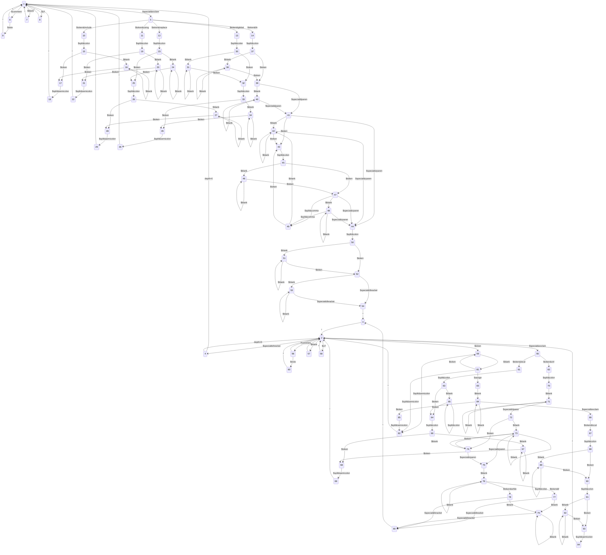
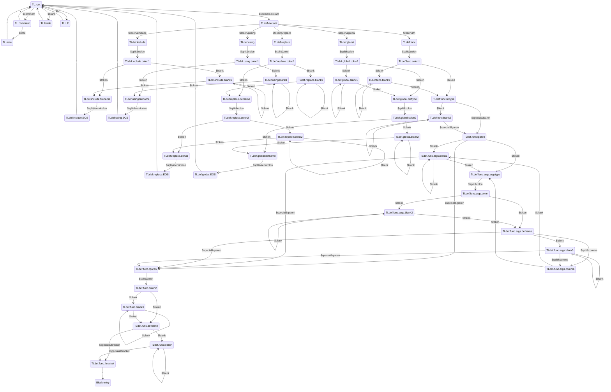
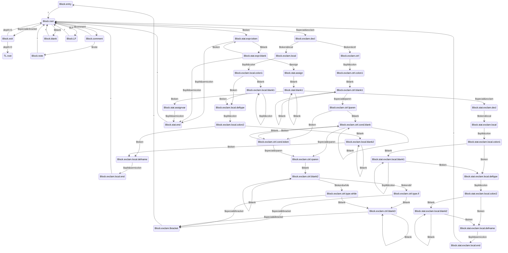

# トークナイザの状態遷移

## 全体図

```mermaid
stateDiagram-v2
1 --> 5: $special&exclam
1 --> 6: $comment
1 --> 7: $blank
1 --> 8: $LF
6 --> 9: $note
6 --> 1: *
9 --> 1: *
7 --> 1: *
8 --> 1: *
5 --> 10: $token&include
5 --> 11: $token&using
5 --> 12: $token&replace
5 --> 13: $token&global
5 --> 14: $token&fn
10 --> 15: $split&colon
15 --> 16: $blank
15 --> 17: $token
16 --> 16: $blank
16 --> 17: $token
17 --> 18: $split&semicolon
18 --> 1: *
11 --> 19: $split&colon
19 --> 20: $blank
19 --> 21: $token
20 --> 20: $blank
20 --> 21: $token
21 --> 22: $split&semicolon
22 --> 1: *
12 --> 23: $split&colon
23 --> 24: $blank
23 --> 25: $token
24 --> 24: $blank
24 --> 25: $token
25 --> 26: $split&colon
26 --> 27: $blank
26 --> 28: $token
27 --> 27: $blank
27 --> 28: $token
28 --> 29: $split&semicolon
29 --> 1: *
13 --> 30: $split&colon
30 --> 31: $blank
30 --> 32: $token
31 --> 31: $blank
31 --> 32: $token
32 --> 33: $split&colon
33 --> 34: $blank
33 --> 35: $token
34 --> 34: $blank
34 --> 35: $token
35 --> 36: $split&semicolon
36 --> 1: *
14 --> 37: $split&colon
37 --> 38: $blank
37 --> 39: $token
38 --> 38: $blank
38 --> 39: $token
39 --> 40: $blank
39 --> 41: $special&lparen
40 --> 40: $blank
40 --> 41: $special&lparen
41 --> 42: $blank
41 --> 43: $token
41 --> 44: $special&rparen
42 --> 42: $blank
42 --> 43: $token
42 --> 44: $special&rparen
43 --> 45: $split&colon
45 --> 46: $blank
45 --> 47: $token
46 --> 46: $blank
46 --> 47: $token
47 --> 48: $blank
47 --> 49: $split&comma
47 --> 44: $special&rparen
48 --> 48: $blank
48 --> 49: $split&comma
48 --> 44: $special&rparen
49 --> 42: $blank
49 --> 43: $token
44 --> 50: $split&colon
50 --> 51: $blank
50 --> 52: $token
51 --> 51: $blank
51 --> 52: $token
52 --> 53: $blank
52 --> 54: $special&lbracket
53 --> 53: $blank
53 --> 54: $special&lbracket
54 --> 3: *
3 --> 2: *
2 --> 55: $special&exclam
2 --> 56: $comment
2 --> 57: $blank
2 --> 58: $LF
2 --> 59: $token
2 --> 4: $special&rbracket
4 --> 1: depth=0
4 --> 2: depth>0
56 --> 60: $note
56 --> 2: *
60 --> 2: *
57 --> 2: *
58 --> 2: *
55 --> 61: $token&local
55 --> 62: $token&ctrl
61 --> 63: $split&colon
63 --> 64: $token
63 --> 65: $blank
65 --> 65: $split&colon
65 --> 64: $token
64 --> 66: $split&colon
66 --> 67: $blank
66 --> 68: $token
67 --> 67: $blank
67 --> 68: $token
68 --> 69: $split&semicolon
69 --> 2: *
62 --> 70: $split&colon
70 --> 71: $blank
71 --> 71: $blank
71 --> 72: $special&lparen
72 --> 73: $blank
72 --> 74: $token
73 --> 73: $blank
73 --> 74: $token
73 --> 75: $special&rparen
74 --> 73: $blank
74 --> 75: $special&rparen
75 --> 76: $blank
76 --> 76: $blank
76 --> 77: $token&if
76 --> 78: $token&while
77 --> 79: $blank
77 --> 80: $special&lbracket
78 --> 79: $blank
78 --> 80: $special&lbracket
79 --> 79: $blank
79 --> 80: $special&lbracket
80 --> 3: *
59 --> 81: $blank
59 --> 82: $split&semicolon
81 --> 59: $token
81 --> 82: $split&semicolon
81 --> 83: $assign
83 --> 84: $blank
84 --> 84: $blank
84 --> 85: $token
84 --> 86: $special&exclam
85 --> 82: $split&semicolon
86 --> 87: $token&local
87 --> 88: $split&colon
88 --> 89: $blank
88 --> 90: $token
89 --> 89: $split&colon
89 --> 90: $token
90 --> 91: $split&colon
91 --> 92: $blank
91 --> 93: $token
92 --> 92: $blank
92 --> 93: $token
93 --> 94: $split&semicolon
94 --> 2: *
82 --> 2: *
```
## 部分

```mermaid
stateDiagram-v2
TL.root --> TLdef.exclam: $special&exclam
TL.root --> TL.comment: $comment
TL.root --> TL.blank: $blank
TL.root --> TL.LF: $LF

TL.comment --> TL.note: $note
TL.comment --> TL.root: *
TL.note --> TL.root: *
TL.blank --> TL.root: *
TL.LF --> TL.root: *

TLdef.exclam --> TLdef.include: $token&include
TLdef.exclam --> TLdef.using: $token&using
TLdef.exclam --> TLdef.replace: $token&replace
TLdef.exclam --> TLdef.global: $token&global
TLdef.exclam --> TLdef.func: $token&fn

TLdef.include --> TLdef.include.colon1: $split&colon
TLdef.include.colon1 --> TLdef.include.blank1: $blank
TLdef.include.colon1 --> TLdef.include.filename: $token
TLdef.include.blank1 --> TLdef.include.blank1: $blank
TLdef.include.blank1 --> TLdef.include.filename: $token
TLdef.include.filename --> TLdef.include.EOS: $split&semicolon
TLdef.include.EOS --> TL.root: *

TLdef.using --> TLdef.using.colon1: $split&colon
TLdef.using.colon1 --> TLdef.using.blank1: $blank
TLdef.using.colon1 --> TLdef.using.filename: $token
TLdef.using.blank1 --> TLdef.using.blank1: $blank
TLdef.using.blank1 --> TLdef.using.filename: $token
TLdef.using.filename --> TLdef.using.EOS: $split&semicolon
TLdef.using.EOS --> TL.root: *

TLdef.replace --> TLdef.replace.colon1: $split&colon
TLdef.replace.colon1 --> TLdef.replace.blank1: $blank
TLdef.replace.colon1 --> TLdef.replace.defname: $token
TLdef.replace.blank1 --> TLdef.replace.blank1: $blank
TLdef.replace.blank1 --> TLdef.replace.defname: $token
TLdef.replace.defname --> TLdef.replace.colon2: $split&colon
TLdef.replace.colon2 --> TLdef.replace.blank2: $blank
TLdef.replace.colon2 --> TLdef.replace.defval: $token
TLdef.replace.blank2 --> TLdef.replace.blank2: $blank
TLdef.replace.blank2 --> TLdef.replace.defval: $token
TLdef.replace.defval --> TLdef.replace.EOS: $split&semicolon
TLdef.replace.EOS --> TL.root: *

TLdef.global --> TLdef.global.colon1: $split&colon
TLdef.global.colon1 --> TLdef.global.blank1: $blank
TLdef.global.colon1 --> TLdef.global.deftype: $token
TLdef.global.blank1 --> TLdef.global.blank1: $blank
TLdef.global.blank1 --> TLdef.global.deftype: $token
TLdef.global.deftype --> TLdef.global.colon2: $split&colon
TLdef.global.colon2 --> TLdef.global.blank2: $blank
TLdef.global.colon2 --> TLdef.global.defname: $token
TLdef.global.blank2 --> TLdef.global.blank2: $blank
TLdef.global.blank2 --> TLdef.global.defname: $token
TLdef.global.defname --> TLdef.global.EOS: $split&semicolon
TLdef.global.EOS --> TL.root: *
TLdef.func --> TLdef.func.colon1: $split&colon
TLdef.func.colon1 --> TLdef.func.blank1: $blank
TLdef.func.colon1 --> TLdef.func.rettype: $token
TLdef.func.blank1 --> TLdef.func.blank1: $blank
TLdef.func.blank1 --> TLdef.func.rettype: $token
TLdef.func.rettype --> TLdef.func.blank2: $blank
TLdef.func.rettype --> TLdef.func.lparen: $special&lparen
TLdef.func.blank2 --> TLdef.func.blank2: $blank
TLdef.func.blank2 --> TLdef.func.lparen: $special&lparen
TLdef.func.lparen --> TLdef.func.args.blank1: $blank
TLdef.func.lparen --> TLdef.func.args.argstype: $token
TLdef.func.lparen --> TLdef.func.rparen: $special&rparen
    TLdef.func.args.blank1 --> TLdef.func.args.blank1: $blank
    TLdef.func.args.blank1 --> TLdef.func.args.argstype: $token
    TLdef.func.args.blank1 --> TLdef.func.rparen: $special&rparen
    TLdef.func.args.argstype --> TLdef.func.args.colon: $split&colon
    TLdef.func.args.colon --> TLdef.func.args.blank2: $blank
    TLdef.func.args.colon --> TLdef.func.args.defname: $token
    TLdef.func.args.blank2 --> TLdef.func.args.blank2: $blank
    TLdef.func.args.blank2 --> TLdef.func.args.defname: $token
    TLdef.func.args.defname --> TLdef.func.args.blank3: $blank
    TLdef.func.args.defname --> TLdef.func.args.comma: $split&comma
    TLdef.func.args.defname --> TLdef.func.rparen: $special&rparen
    TLdef.func.args.blank3 --> TLdef.func.args.blank3: $blank
    TLdef.func.args.blank3 --> TLdef.func.args.comma: $split&comma
    TLdef.func.args.blank3 --> TLdef.func.rparen: $special&rparen
    TLdef.func.args.comma --> TLdef.func.args.blank1: $blank
    TLdef.func.args.comma --> TLdef.func.args.argstype: $token
TLdef.func.rparen --> TLdef.func.colon2: $split&colon
TLdef.func.colon2 --> TLdef.func.blank3: $blank
TLdef.func.colon2 --> TLdef.func.defname: $token
TLdef.func.blank3 --> TLdef.func.blank3: $blank
TLdef.func.blank3 --> TLdef.func.defname: $token
TLdef.func.defname --> TLdef.func.blank4: $blank
TLdef.func.defname --> TLdef.func.lbracket: $special&lbracket
TLdef.func.blank4 --> TLdef.func.blank4: $blank
TLdef.func.blank4 --> TLdef.func.lbracket: $special&lbracket
TLdef.func.lbracket --> Block.entry: *

```

```mermaid
stateDiagram-v2

Block.entry --> Block.root: *
Block.root --> Block.exclam.decl: $special&exclam
Block.root --> Block.comment: $comment
Block.root --> Block.blank: $blank
Block.root --> Block.LF: $LF
Block.root --> Block.stat.expr.token: $token
Block.root --> Block.exit: $special&rbracket

Block.exit --> TL.root: depth=0
Block.exit --> Block.root: depth>0

Block.comment --> Block.note: $note
Block.comment --> Block.root: *
Block.note --> Block.root: *
Block.blank --> Block.root: *
Block.LF --> Block.root: *

Block.exclam.decl --> Block.exclam.local: $token&local
Block.exclam.decl --> Block.exclam.ctrl: $token&ctrl

Block.exclam.local --> Block.exclam.local.colon1: $split&colon
Block.exclam.local.colon1 --> Block.exclam.local.deftype: $token
Block.exclam.local.colon1 --> Block.exclam.local.blank1: $blank
Block.exclam.local.blank1 --> Block.exclam.local.blank1: $split&colon
Block.exclam.local.blank1 --> Block.exclam.local.deftype: $token
Block.exclam.local.deftype --> Block.exclam.local.colon2: $split&colon
Block.exclam.local.colon2 --> Block.exclam.local.blank2: $blank
Block.exclam.local.colon2 --> Block.exclam.local.defname: $token
Block.exclam.local.blank2 --> Block.exclam.local.blank2: $blank
Block.exclam.local.blank2 --> Block.exclam.local.defname: $token
Block.exclam.local.defname --> Block.exclam.local.end: $split&semicolon
Block.exclam.local.end --> Block.root: *

Block.exclam.ctrl --> Block.exclam.ctrl.colon1: $split&colon
Block.exclam.ctrl.colon1 --> Block.exclam.ctrl.blank1: $blank
Block.exclam.ctrl.blank1 --> Block.exclam.ctrl.blank1: $blank
Block.exclam.ctrl.blank1 --> Block.exclam.ctrl.lparen: $special&lparen
Block.exclam.ctrl.lparen --> Block.exclam.ctrl.cond.blank: $blank
Block.exclam.ctrl.lparen --> Block.exclam.ctrl.cond.token: $token
Block.exclam.ctrl.cond.blank --> Block.exclam.ctrl.cond.blank: $blank
Block.exclam.ctrl.cond.blank --> Block.exclam.ctrl.cond.token: $token
Block.exclam.ctrl.cond.blank --> Block.exclam.ctrl.rparen: $special&rparen
Block.exclam.ctrl.cond.token --> Block.exclam.ctrl.cond.blank: $blank
Block.exclam.ctrl.cond.token --> Block.exclam.ctrl.rparen: $special&rparen
Block.exclam.ctrl.rparen --> Block.exclam.ctrl.blank2: $blank
Block.exclam.ctrl.blank2 --> Block.exclam.ctrl.blank2: $blank
Block.exclam.ctrl.blank2 --> Block.exclam.ctrl.type.if: $token&if
Block.exclam.ctrl.blank2 --> Block.exclam.ctrl.type.while: $token&while
    Block.exclam.ctrl.type.if --> Block.exclam.ctrl.blank3: $blank
    Block.exclam.ctrl.type.if --> Block.exclam.lbracket: $special&lbracket
    Block.exclam.ctrl.type.while --> Block.exclam.ctrl.blank3: $blank
    Block.exclam.ctrl.type.while --> Block.exclam.lbracket: $special&lbracket
Block.exclam.ctrl.blank3 --> Block.exclam.ctrl.blank3: $blank
Block.exclam.ctrl.blank3 --> Block.exclam.lbracket: $special&lbracket
Block.exclam.lbracket --> Block.entry: *


Block.stat.expr.token --> Block.stat.expr.blank: $blank
Block.stat.expr.token --> Block.stat.end: $split&semicolon
Block.stat.expr.blank --> Block.stat.expr.token: $token
Block.stat.expr.blank --> Block.stat.end: $split&semicolon
Block.stat.expr.blank --> Block.stat.assign: $assign
Block.stat.assign --> Block.stat.blank1: $blank
Block.stat.blank1 --> Block.stat.blank1: $blank
Block.stat.blank1 --> Block.stat.assignvar: $token
Block.stat.blank1 --> Block.stat.exclam.decl: $special&exclam
Block.stat.assignvar --> Block.stat.end: $split&semicolon
    Block.stat.exclam.decl --> Block.stat.exclam.local: $token&local
    Block.stat.exclam.local --> Block.stat.exclam.local.colon1: $split&colon
    Block.stat.exclam.local.colon1 --> Block.stat.exclam.local.blank1: $blank
    Block.stat.exclam.local.colon1 --> Block.stat.exclam.local.deftype: $token
    Block.stat.exclam.local.blank1 --> Block.stat.exclam.local.blank1: $split&colon
    Block.stat.exclam.local.blank1 --> Block.stat.exclam.local.deftype: $token
    Block.stat.exclam.local.deftype --> Block.stat.exclam.local.colon2: $split&colon
    Block.stat.exclam.local.colon2 --> Block.stat.exclam.local.blank2: $blank
    Block.stat.exclam.local.colon2 --> Block.stat.exclam.local.defname: $token
    Block.stat.exclam.local.blank2 --> Block.stat.exclam.local.blank2: $blank
    Block.stat.exclam.local.blank2 --> Block.stat.exclam.local.defname: $token
    Block.stat.exclam.local.defname --> Block.stat.exclam.local.end: $split&semicolon
    Block.stat.exclam.local.end --> Block.root: *
Block.stat.end --> Block.root: *
```