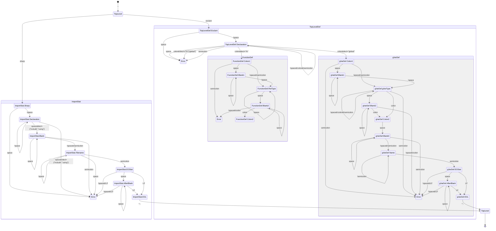

# 状態遷移

```mermaid
stateDiagram-v2

    ImportStat.Error: Error
    TopLevelDef.Error: Error
    FunctionDef.Error: Error
    gVarDef.Error: Error

    [*] --> TopLevel: *
    Return2.TopLevel: TopLevel
    Return2.TopLevel --> [*]

    TopLevel --> ImportStat.Sharp: sharp
    TopLevel --> TopLevelDef.Exclam: exclam

    gVarDef.EOL --> Return2.TopLevel: * -
    ImportStat.EOL --> Return2.TopLevel: * -

    state ImportStat {
        ImportStat.Sharp --> ImportStat.Error: space
        ImportStat.Sharp --> ImportStat.Declaration: !space
        ImportStat.Declaration --> ImportStat.Blank: space&decl=("include","using")
        ImportStat.Declaration --> ImportStat.Error: space&!decl=("include","using")
        ImportStat.Declaration --> ImportStat.Declaration: !space
        ImportStat.Blank --> ImportStat.Blank: space
        ImportStat.Blank --> ImportStat.Error: semicolon
        ImportStat.Blank --> ImportStat.Filename: !space&!semicolon
        ImportStat.Filename --> ImportStat.Filename: !space
        ImportStat.Filename --> ImportStat.EOStat: semicolon
        ImportStat.Filename --> ImportStat.Error: space
        ImportStat.EOStat --> ImportStat.AfterBlank: space
        ImportStat.EOStat --> ImportStat.Error: !space&!LF
        ImportStat.AfterBlank --> ImportStat.AfterBlank: space
        ImportStat.AfterBlank --> ImportStat.EOL: LF
        ImportStat.EOStat --> ImportStat.EOL: LF
        ImportStat.AfterBlank --> ImportStat.Error: !space&!LF
    }
    state TopLevelDef {
        TopLevelDef.Exclam --> TopLevelDef.Error: space
        TopLevelDef.Exclam --> TopLevelDef.Declaration: !space
        TopLevelDef.Declaration --> TopLevelDef.Declaration: !space&!colon&!semicolon
        TopLevelDef.Declaration --> TopLevelDef.Error: space
        TopLevelDef.Declaration --> TopLevelDef.Error: colon&!decl=("fn"|"global")
        TopLevelDef.Declaration --> TopLevelDef.Error: semicolon
        TopLevelDef.Declaration --> gVarDef.Colon1: colon&decl="global"
        TopLevelDef.Declaration --> FunctionDef.Colon1: colon&decl="fn"
        state FunctionDef {
            FunctionDef.Colon1 --> FunctionDef.Blank1: space
            FunctionDef.Colon1 --> FunctionDef.Error: semicolon
            FunctionDef.Colon1 --> FunctionDef.RetType: !space&!semicolon
            FunctionDef.Blank1 --> FunctionDef.Blank1: space
            FunctionDef.Blank1 --> FunctionDef.RetType: !space
            FunctionDef.RetType --> FunctionDef.RetType: !space
            FunctionDef.RetType --> FunctionDef.Blank2: space
            FunctionDef.Blank2 --> FunctionDef.Blank2: space
            FunctionDef.Blank2 --> FunctionDef.Error: !space&!colon
            FunctionDef.Blank2 --> FunctionDef.Colon2: colon
        }
        state gVarDef {
            gVarDef.Colon1 --> gVarDef.Blank1: space
            gVarDef.Colon1 --> gVarDef.Error: semicolon
            gVarDef.Colon1 --> gVarDef.gVarType: !space&!semicolon
            gVarDef.Blank1 --> gVarDef.Blank1: space
            gVarDef.Blank1 --> gVarDef.gVarType: !space
            gVarDef.gVarType --> gVarDef.Blank2: space
            gVarDef.Blank2 --> gVarDef.Colon2: colon
            gVarDef.gVarType --> gVarDef.Error: semicolon
            gVarDef.gVarType --> gVarDef.Colon2: colon
            gVarDef.gVarType --> gVarDef.gVarType: !space&!colon&!semicolon
            gVarDef.Blank2 --> gVarDef.Error: !space&!colon
            gVarDef.Blank2 --> gVarDef.Blank2: space
            gVarDef.Colon2 --> gVarDef.Blank3: space
            gVarDef.Blank3 --> gVarDef.Blank3: space
            gVarDef.Blank3 --> gVarDef.Error: semicolon
            gVarDef.Blank3 --> gVarDef.Name: !space&!semicolon
            gVarDef.Name --> gVarDef.EOStat: semicolon
            gVarDef.Name --> gVarDef.Name: !semicolon
            gVarDef.EOStat --> gVarDef.AfterBlank: space
            gVarDef.EOStat --> gVarDef.Error: !space&!LF
            gVarDef.AfterBlank --> gVarDef.EOL: LF
            gVarDef.AfterBlank --> gVarDef.AfterBlank: space
            gVarDef.EOStat --> gVarDef.EOL: LF
            gVarDef.AfterBlank --> gVarDef.Error: !space&!LF
        }
    }

```