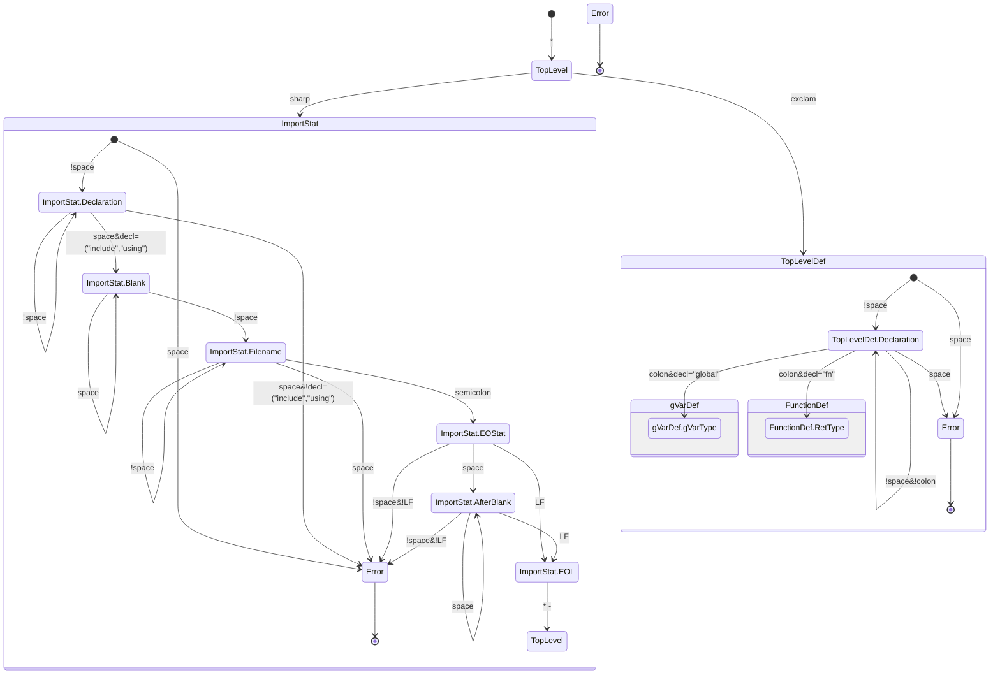

# 状態遷移

```mermaid
stateDiagram-v2

    %% ImportStat: include/using
    %% TopLevelDef: global/function

    %% ImportStat.Declaration: Decl
    %% ImportStat.Blank: Blank
    %% ImportStat.Filename: fName
    %% ImportStat.EOS: EOS
    ImportStat.Error: Error

    %% TopLevelDef.Declaration: Decl
    TopLevelDef.Error: Error

    [*] --> TopLevel: *
    Error --> [*]

    TopLevel --> ImportStat: sharp
    TopLevel --> TopLevelDef: exclam


    ImportStat.TopLevel: TopLevel

    state ImportStat {
        [*] --> ImportStat.Error: space
        [*] --> ImportStat.Declaration: !space
        ImportStat.Declaration --> ImportStat.Blank: space&decl=("include","using")
        ImportStat.Declaration --> ImportStat.Error: space&!decl=("include","using")
        ImportStat.Declaration --> ImportStat.Declaration: !space
        ImportStat.Blank --> ImportStat.Blank: space
        ImportStat.Blank --> ImportStat.Filename: !space
        ImportStat.Filename --> ImportStat.Filename: !space
        ImportStat.Filename --> ImportStat.EOStat: semicolon
        ImportStat.Filename --> ImportStat.Error: space
        ImportStat.Error --> [*]
        ImportStat.EOStat --> ImportStat.AfterBlank: space
        ImportStat.EOStat --> ImportStat.EOL: LF
        ImportStat.EOStat --> ImportStat.Error: !space&!LF
        ImportStat.AfterBlank --> ImportStat.AfterBlank: space
        ImportStat.AfterBlank --> ImportStat.EOL: LF
        ImportStat.AfterBlank --> ImportStat.Error: !space&!LF
        ImportStat.EOL --> ImportStat.TopLevel: * -
    }

    state TopLevelDef {
        [*] --> TopLevelDef.Error: space
        [*] --> TopLevelDef.Declaration: !space
        TopLevelDef.Declaration --> TopLevelDef.Declaration: !space&!colon
        TopLevelDef.Declaration --> TopLevelDef.Error: space
        TopLevelDef.Declaration --> gVarDef.gVarType: colon&decl="global"
        TopLevelDef.Declaration --> FunctionDef.RetType: colon&decl="fn"
        TopLevelDef.Error --> [*]
        state FunctionDef {
            FunctionDef.RetType
        }
        state gVarDef {
            gVarDef.gVarType
        }
    }

```