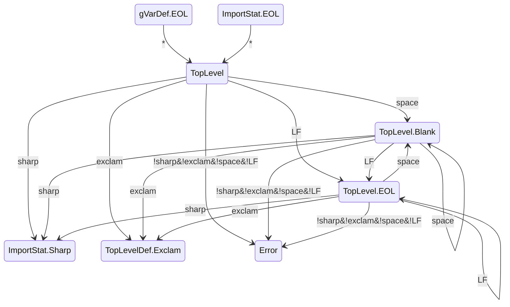
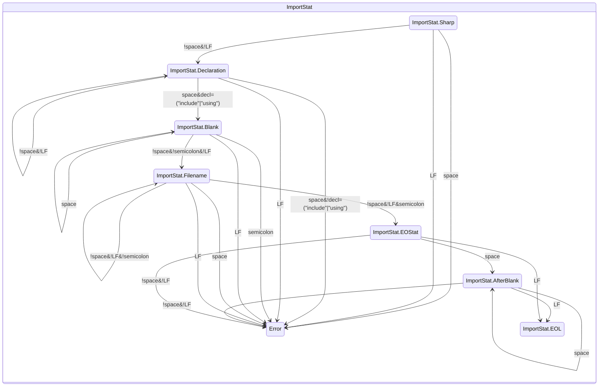
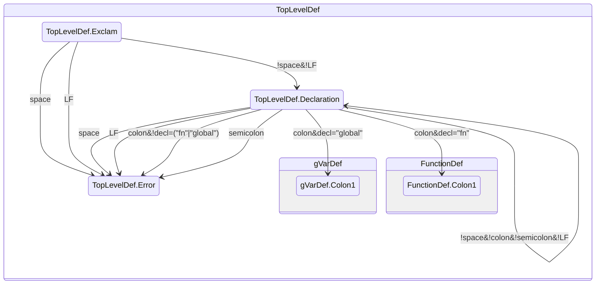
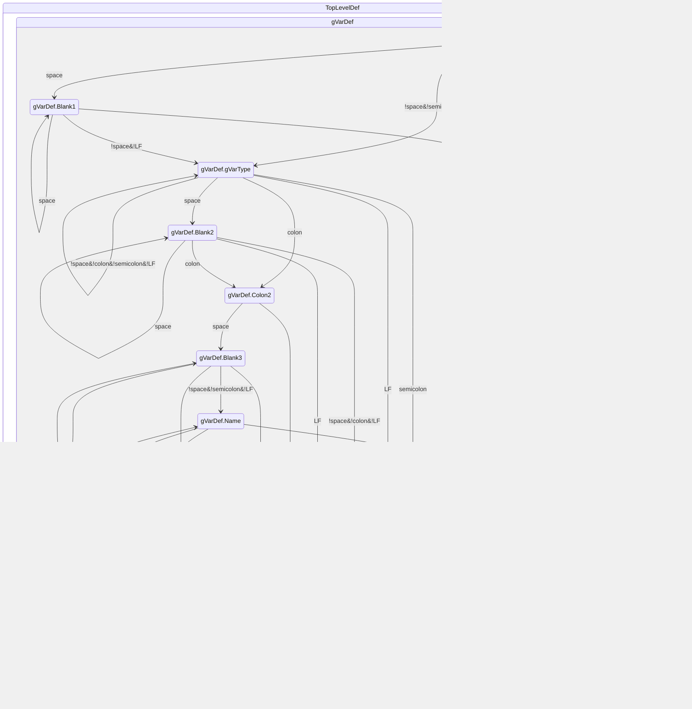
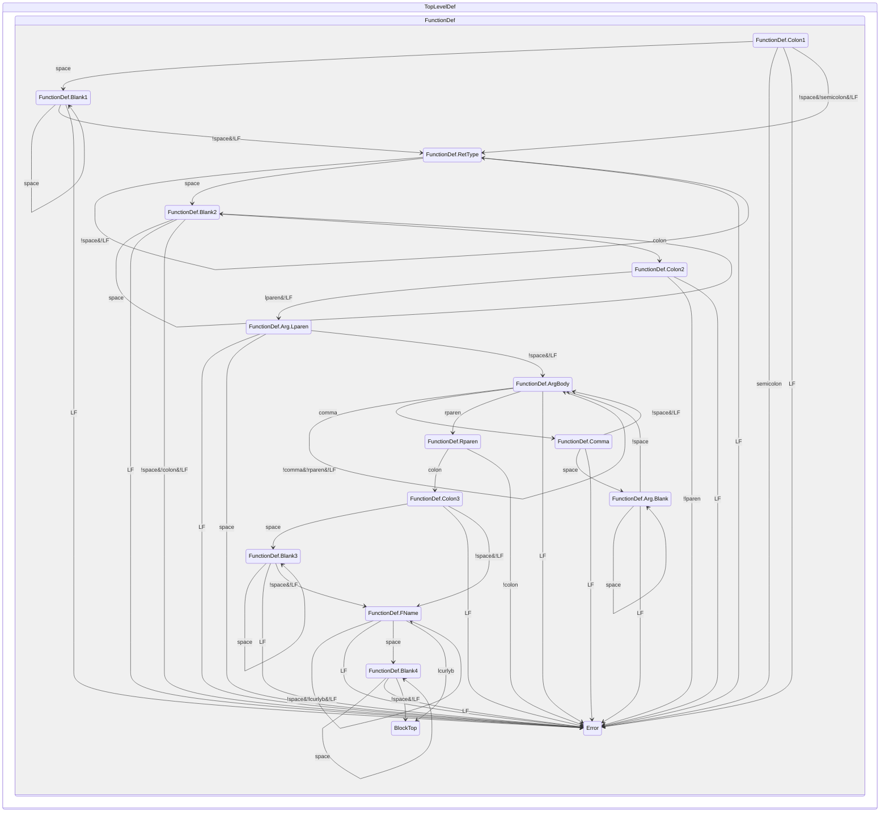

# トークナイザの状態遷移

## 全体図

```mermaid
stateDiagram-v2
TopLevel --> ImportStat.Sharp: sharp
TopLevel --> TopLevelDef.Exclam: exclam
TopLevel --> TopLevel.Blank: space
TopLevel --> TopLevel.EOL: LF
TopLevel --> Error: !sharp&!exclam&!space&!LF
TopLevel.Blank --> TopLevel.Blank: space
TopLevel.Blank --> TopLevel.EOL: LF
TopLevel.Blank --> ImportStat.Sharp: sharp
TopLevel.Blank --> TopLevelDef.Exclam: exclam
TopLevel.Blank --> Error: !sharp&!exclam&!space&!LF
TopLevel.EOL --> TopLevel.Blank: space
TopLevel.EOL --> TopLevel.EOL: LF
TopLevel.EOL --> ImportStat.Sharp: sharp
TopLevel.EOL --> TopLevelDef.Exclam: exclam
TopLevel.EOL --> Error: !sharp&!exclam&!space&!LF
gVarDef.EOL --> TopLevel: *
ImportStat.EOL --> TopLevel: *
ImportStat.Sharp --> ImportStat.Error: space
ImportStat.Sharp --> ImportStat.Error: LF
ImportStat.Sharp --> ImportStat.Declaration: !space&!LF
ImportStat.Declaration --> ImportStat.Blank: space&decl=("include"|"using")
ImportStat.Declaration --> ImportStat.Error: space&!decl=("include"|"using")
ImportStat.Declaration --> ImportStat.Declaration: !space&!LF
ImportStat.Declaration --> ImportStat.Error: LF
ImportStat.Blank --> ImportStat.Blank: space
ImportStat.Blank --> ImportStat.Error: semicolon
ImportStat.Blank --> ImportStat.Filename: !space&!semicolon&!LF
ImportStat.Blank --> ImportStat.Error: LF
ImportStat.Filename --> ImportStat.Filename: !space&!LF&!semicolon
ImportStat.Filename --> ImportStat.EOStat: !space&!LF&semicolon
ImportStat.Filename --> ImportStat.Error: space
ImportStat.Filename --> ImportStat.Error: LF
ImportStat.AfterBlank --> ImportStat.AfterBlank: space
ImportStat.AfterBlank --> ImportStat.EOL: LF
ImportStat.AfterBlank --> ImportStat.Error: !space&!LF
ImportStat.EOStat --> ImportStat.AfterBlank: space
ImportStat.EOStat --> ImportStat.Error: !space&!LF
ImportStat.EOStat --> ImportStat.EOL: LF
TopLevelDef.Exclam --> TopLevelDef.Error: space
TopLevelDef.Exclam --> TopLevelDef.Error: LF
TopLevelDef.Exclam --> TopLevelDef.Declaration: !space&!LF
TopLevelDef.Declaration --> TopLevelDef.Declaration: !space&!colon&!semicolon&!LF
TopLevelDef.Declaration --> TopLevelDef.Error: space
TopLevelDef.Declaration --> TopLevelDef.Error: LF
TopLevelDef.Declaration --> TopLevelDef.Error: colon&!decl=("fn"|"global")
TopLevelDef.Declaration --> TopLevelDef.Error: semicolon
TopLevelDef.Declaration --> gVarDef.Colon1: colon&decl="global"
TopLevelDef.Declaration --> FunctionDef.Colon1: colon&decl="fn"
gVarDef.Colon1 --> gVarDef.Blank1: space
gVarDef.Colon1 --> gVarDef.Error: semicolon
gVarDef.Colon1 --> gVarDef.Error: LF
gVarDef.Colon1 --> gVarDef.gVarType: !space&!semicolon&!LF
gVarDef.Blank1 --> gVarDef.Blank1: space
gVarDef.Blank1 --> gVarDef.gVarType: !space&!LF
gVarDef.Blank1 --> gVarDef.Error: LF
gVarDef.gVarType --> gVarDef.Blank2: space
gVarDef.gVarType --> gVarDef.Error: semicolon
gVarDef.gVarType --> gVarDef.Error: LF
gVarDef.gVarType --> gVarDef.Colon2: colon
gVarDef.gVarType --> gVarDef.gVarType: !space&!colon&!semicolon&!LF
gVarDef.Blank2 --> gVarDef.Colon2: colon
gVarDef.Blank2 --> gVarDef.Error: !space&!colon&!LF
gVarDef.Blank2 --> gVarDef.Blank2: space
gVarDef.Blank2 --> gVarDef.Error: LF
gVarDef.Colon2 --> gVarDef.Blank3: space
gVarDef.Colon2 --> gVarDef.Error: !space
gVarDef.Blank3 --> gVarDef.Blank3: space
gVarDef.Blank3 --> gVarDef.Error: semicolon
gVarDef.Blank3 --> gVarDef.Error: LF
gVarDef.Blank3 --> gVarDef.Name: !space&!semicolon&!LF
gVarDef.Name --> gVarDef.EOStat: semicolon
gVarDef.Name --> gVarDef.Name: !semicolon&!LF
gVarDef.Name --> gVarDef.Error: LF
gVarDef.EOStat --> gVarDef.AfterBlank: space
gVarDef.EOStat --> gVarDef.Error: !space&!LF
gVarDef.AfterBlank --> gVarDef.EOL: LF
gVarDef.AfterBlank --> gVarDef.AfterBlank: space
gVarDef.EOStat --> gVarDef.EOL: LF
gVarDef.AfterBlank --> gVarDef.Error: !space&!LF
FunctionDef.Colon1 --> FunctionDef.Blank1: space
FunctionDef.Colon1 --> FunctionDef.Error: semicolon
FunctionDef.Colon1 --> FunctionDef.Error: LF
FunctionDef.Colon1 --> FunctionDef.RetType: !space&!semicolon&!LF
FunctionDef.Blank1 --> FunctionDef.Blank1: space
FunctionDef.Blank1 --> FunctionDef.RetType: !space&!LF
FunctionDef.Blank1 --> FunctionDef.Error: LF
FunctionDef.RetType --> FunctionDef.RetType: !space&!LF
FunctionDef.RetType --> FunctionDef.Blank2: space
FunctionDef.RetType --> FunctionDef.Error: LF
FunctionDef.Blank2 --> FunctionDef.Blank2: space
FunctionDef.Blank2 --> FunctionDef.Error: LF
FunctionDef.Blank2 --> FunctionDef.Error: !space&!colon&!LF
FunctionDef.Blank2 --> FunctionDef.Colon2: colon
FunctionDef.Colon2 --> FunctionDef.Arg.Lparen: lparen&!LF
FunctionDef.Colon2 --> FunctionDef.Error: !lparen
FunctionDef.Colon2 --> FunctionDef.Error: LF
FunctionDef.Arg.Lparen --> FunctionDef.Error: LF
FunctionDef.Arg.Lparen --> FunctionDef.Error: space
FunctionDef.Arg.Lparen --> FunctionDef.ArgBody: !space&!LF
FunctionDef.Arg.Blank --> FunctionDef.Arg.Blank: space
FunctionDef.Arg.Blank --> FunctionDef.Error: LF
FunctionDef.Arg.Blank --> FunctionDef.ArgBody: !space
FunctionDef.ArgBody --> FunctionDef.ArgBody: !comma&!rparen&!LF
FunctionDef.ArgBody --> FunctionDef.Comma: comma
FunctionDef.ArgBody --> FunctionDef.Rparen: rparen
FunctionDef.ArgBody --> FunctionDef.Error: LF
FunctionDef.Comma --> FunctionDef.Arg.Blank: space
FunctionDef.Comma --> FunctionDef.Error: LF
FunctionDef.Comma --> FunctionDef.ArgBody: !space&!LF
FunctionDef.Rparen --> FunctionDef.Colon3: colon
FunctionDef.Rparen --> FunctionDef.Error: !colon
FunctionDef.Colon3 --> FunctionDef.Blank3: space
FunctionDef.Colon3 --> FunctionDef.Error: LF
FunctionDef.Colon3 --> FunctionDef.FName: !space&!LF
FunctionDef.Blank3 --> FunctionDef.Blank3: space
FunctionDef.Blank3 --> FunctionDef.Error: LF
FunctionDef.Blank3 --> FunctionDef.FName: !space&!LF
FunctionDef.FName --> FunctionDef.FName: !space&!lcurlyb&!LF
FunctionDef.FName --> FunctionDef.Error: LF
FunctionDef.FName --> FunctionDef.Blank4: space
FunctionDef.FName --> BlockTop: lcurlyb
FunctionDef.Blank4 --> FunctionDef.Blank4: space
FunctionDef.Blank4 --> FunctionDef.Error: LF
FunctionDef.Blank4 --> BlockTop: !space&!LF
```
## 部分

```mermaid
stateDiagram-v2
TopLevel --> ImportStat.Sharp: sharp
TopLevel --> TopLevelDef.Exclam: exclam
TopLevel --> TopLevel.Blank: space
TopLevel --> TopLevel.EOL: LF
TopLevel --> Error: !sharp&!exclam&!space&!LF
TopLevel.Blank --> TopLevel.Blank: space
TopLevel.Blank --> TopLevel.EOL: LF
TopLevel.Blank --> ImportStat.Sharp: sharp
TopLevel.Blank --> TopLevelDef.Exclam: exclam
TopLevel.Blank --> Error: !sharp&!exclam&!space&!LF
TopLevel.EOL --> TopLevel.Blank: space
TopLevel.EOL --> TopLevel.EOL: LF
TopLevel.EOL --> ImportStat.Sharp: sharp
TopLevel.EOL --> TopLevelDef.Exclam: exclam
TopLevel.EOL --> Error: !sharp&!exclam&!space&!LF

gVarDef.EOL --> TopLevel: *
ImportStat.EOL --> TopLevel: *

```

```mermaid
stateDiagram-v2
ImportStat.Error: Error
state ImportStat {
    ImportStat.Sharp --> ImportStat.Error: space
    ImportStat.Sharp --> ImportStat.Error: LF
    ImportStat.Sharp --> ImportStat.Declaration: !space&!LF
    ImportStat.Declaration --> ImportStat.Blank: space&decl=("include"|"using")
    ImportStat.Declaration --> ImportStat.Error: space&!decl=("include"|"using")
    ImportStat.Declaration --> ImportStat.Declaration: !space&!LF
    ImportStat.Declaration --> ImportStat.Error: LF
    ImportStat.Blank --> ImportStat.Blank: space
    ImportStat.Blank --> ImportStat.Error: semicolon
    ImportStat.Blank --> ImportStat.Filename: !space&!semicolon&!LF
    ImportStat.Blank --> ImportStat.Error: LF
    ImportStat.Filename --> ImportStat.Filename: !space&!LF&!semicolon
    ImportStat.Filename --> ImportStat.EOStat: !space&!LF&semicolon
    ImportStat.Filename --> ImportStat.Error: space
    ImportStat.Filename --> ImportStat.Error: LF
    ImportStat.AfterBlank --> ImportStat.AfterBlank: space
    ImportStat.AfterBlank --> ImportStat.EOL: LF
    ImportStat.AfterBlank --> ImportStat.Error: !space&!LF
    ImportStat.EOStat --> ImportStat.AfterBlank: space
    ImportStat.EOStat --> ImportStat.Error: !space&!LF
    ImportStat.EOStat --> ImportStat.EOL: LF
}
```

```mermaid
stateDiagram-v2
state TopLevelDef {
    TopLevelDef.Exclam --> TopLevelDef.Error: space
    TopLevelDef.Exclam --> TopLevelDef.Error: LF
    TopLevelDef.Exclam --> TopLevelDef.Declaration: !space&!LF
    TopLevelDef.Declaration --> TopLevelDef.Declaration: !space&!colon&!semicolon&!LF
    TopLevelDef.Declaration --> TopLevelDef.Error: space
    TopLevelDef.Declaration --> TopLevelDef.Error: LF
    TopLevelDef.Declaration --> TopLevelDef.Error: colon&!decl=("fn"|"global")
    TopLevelDef.Declaration --> TopLevelDef.Error: semicolon
    TopLevelDef.Declaration --> gVarDef.Colon1: colon&decl="global"
    TopLevelDef.Declaration --> FunctionDef.Colon1: colon&decl="fn"
    state FunctionDef {
        FunctionDef.Colon1
    }
    state gVarDef {
        gVarDef.Colon1
    }
}
```

```mermaid
stateDiagram-v2
gVarDef.Error: Error
state TopLevelDef {
    state gVarDef {
        gVarDef.Colon1 --> gVarDef.Blank1: space
        gVarDef.Colon1 --> gVarDef.Error: semicolon
        gVarDef.Colon1 --> gVarDef.Error: LF
        gVarDef.Colon1 --> gVarDef.gVarType: !space&!semicolon&!LF
        gVarDef.Blank1 --> gVarDef.Blank1: space
        gVarDef.Blank1 --> gVarDef.gVarType: !space&!LF
        gVarDef.Blank1 --> gVarDef.Error: LF
        gVarDef.gVarType --> gVarDef.Blank2: space
        gVarDef.gVarType --> gVarDef.Error: semicolon
        gVarDef.gVarType --> gVarDef.Error: LF
        gVarDef.gVarType --> gVarDef.Colon2: colon
        gVarDef.gVarType --> gVarDef.gVarType: !space&!colon&!semicolon&!LF
        gVarDef.Blank2 --> gVarDef.Colon2: colon
        gVarDef.Blank2 --> gVarDef.Error: !space&!colon&!LF
        gVarDef.Blank2 --> gVarDef.Blank2: space
        gVarDef.Blank2 --> gVarDef.Error: LF
        gVarDef.Colon2 --> gVarDef.Blank3: space
        gVarDef.Colon2 --> gVarDef.Error: !space
        gVarDef.Blank3 --> gVarDef.Blank3: space
        gVarDef.Blank3 --> gVarDef.Error: semicolon
        gVarDef.Blank3 --> gVarDef.Error: LF
        gVarDef.Blank3 --> gVarDef.Name: !space&!semicolon&!LF
        gVarDef.Name --> gVarDef.EOStat: semicolon
        gVarDef.Name --> gVarDef.Name: !semicolon&!LF
        gVarDef.Name --> gVarDef.Error: LF
        gVarDef.EOStat --> gVarDef.AfterBlank: space
        gVarDef.EOStat --> gVarDef.Error: !space&!LF
        gVarDef.AfterBlank --> gVarDef.EOL: LF
        gVarDef.AfterBlank --> gVarDef.AfterBlank: space
        gVarDef.EOStat --> gVarDef.EOL: LF
        gVarDef.AfterBlank --> gVarDef.Error: !space&!LF
    }
}
```

```mermaid
stateDiagram-v2
FunctionDef.Error: Error
state TopLevelDef {
    state FunctionDef {
        FunctionDef.Colon1 --> FunctionDef.Blank1: space
        FunctionDef.Colon1 --> FunctionDef.Error: semicolon
        FunctionDef.Colon1 --> FunctionDef.Error: LF
        FunctionDef.Colon1 --> FunctionDef.RetType: !space&!semicolon&!LF
        FunctionDef.Blank1 --> FunctionDef.Blank1: space
        FunctionDef.Blank1 --> FunctionDef.RetType: !space&!LF
        FunctionDef.Blank1 --> FunctionDef.Error: LF
        FunctionDef.RetType --> FunctionDef.RetType: !space&!LF
        FunctionDef.RetType --> FunctionDef.Blank2: space
        FunctionDef.RetType --> FunctionDef.Error: LF
        FunctionDef.Blank2 --> FunctionDef.Blank2: space
        FunctionDef.Blank2 --> FunctionDef.Error: LF
        FunctionDef.Blank2 --> FunctionDef.Error: !space&!colon&!LF
        FunctionDef.Blank2 --> FunctionDef.Colon2: colon
        FunctionDef.Colon2 --> FunctionDef.Arg.Lparen: lparen&!LF
        FunctionDef.Colon2 --> FunctionDef.Error: !lparen
        FunctionDef.Colon2 --> FunctionDef.Error: LF
        FunctionDef.Arg.Lparen --> FunctionDef.Error: LF
        FunctionDef.Arg.Lparen --> FunctionDef.Error: space
        FunctionDef.Arg.Lparen --> FunctionDef.ArgBody: !space&!LF
        FunctionDef.Arg.Blank --> FunctionDef.Arg.Blank: space
        FunctionDef.Arg.Blank --> FunctionDef.Error: LF
        FunctionDef.Arg.Blank --> FunctionDef.ArgBody: !space
        FunctionDef.ArgBody --> FunctionDef.ArgBody: !comma&!rparen&!LF
        FunctionDef.ArgBody --> FunctionDef.Comma: comma
        FunctionDef.ArgBody --> FunctionDef.Rparen: rparen
        FunctionDef.ArgBody --> FunctionDef.Error: LF
        FunctionDef.Comma --> FunctionDef.Arg.Blank: space
        FunctionDef.Comma --> FunctionDef.Error: LF
        FunctionDef.Comma --> FunctionDef.ArgBody: !space&!LF
        FunctionDef.Rparen --> FunctionDef.Colon3: colon
        FunctionDef.Rparen --> FunctionDef.Error: !colon
        FunctionDef.Colon3 --> FunctionDef.Blank3: space
        FunctionDef.Colon3 --> FunctionDef.Error: LF
        FunctionDef.Colon3 --> FunctionDef.FName: !space&!LF
        FunctionDef.Blank3 --> FunctionDef.Blank3: space
        FunctionDef.Blank3 --> FunctionDef.Error: LF
        FunctionDef.Blank3 --> FunctionDef.FName: !space&!LF
        FunctionDef.FName --> FunctionDef.FName: !space&!lcurlyb&!LF
        FunctionDef.FName --> FunctionDef.Error: LF
        FunctionDef.FName --> FunctionDef.Blank4: space
        FunctionDef.FName --> BlockTop: lcurlyb
        FunctionDef.Blank4 --> FunctionDef.Blank4: space
        FunctionDef.Blank4 --> FunctionDef.Error: LF
        FunctionDef.Blank4 --> BlockTop: !space&!LF
    }
}
```